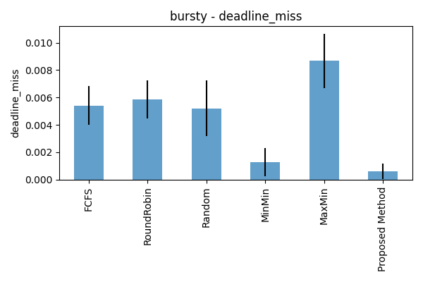
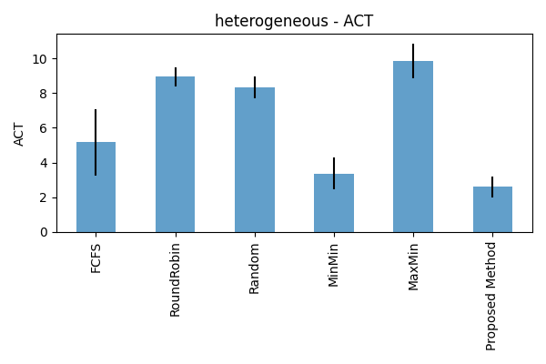
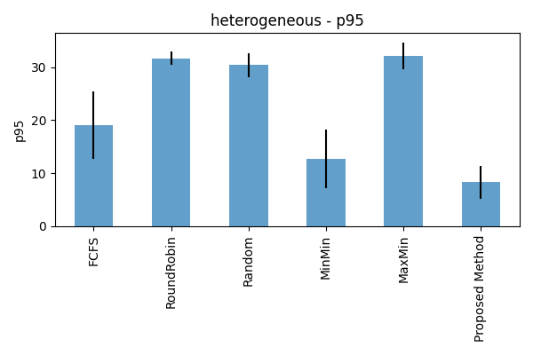

# Predictive VM Scheduling Model for Edge-Cloud Environments

A machine learning-based virtual machine scheduler that predicts task runtimes and optimizes scheduling decisions in heterogeneous edge-cloud computing environments.

## Overview

This project presents a hybrid predictive scheduler that combines:

- **Runtime prediction** using Gradient Boosting Regressors
- **Online learning** to adapt to changing workloads
- **Feature engineering** capturing task-VM compatibility
- **Discrete-event simulation** modeling realistic edge-cloud scenarios

The scheduler outperforms baseline methods (FCFS, RoundRobin, MinMin, MaxMin, Random) across multiple workload patterns.

## Features

- **Hybrid Predictive Scheduling**: ML-based runtime prediction with online adaptation
- **Multiple Workload Scenarios**: Stationary, bursty, and heterogeneous task patterns
- **Comprehensive Baselines**: Five classical scheduling algorithms for comparison
- **Real-time Learning**: Online model updates every N tasks
- **Network-Aware**: Models dynamic latency and bandwidth
- **Resource Heterogeneity**: Diverse VM configurations (CPU, memory, IOPS, architecture)

## Results

### Experimental Setup

- **Scenarios**: Stationary, Bursty, Heterogeneous workloads
- **Schedulers**: Random, FCFS, RoundRobin, MinMin, MaxMin, Proposed Method
- **Metrics**: Average Completion Time (ACT), Makespan, P95 latency, Deadline Miss Rate
- **Repetitions**: 5 random seeds per scenario

### Stationary Workload Results

#### Average Completion Time (ACT)

<!-- Placeholder: Replace with your result image -->

#### 95th Percentile Latency (P95)

#### Deadline Miss Rate

#### Makespan

---

### Bursty Workload Results

#### Average Completion Time (ACT)

#### 95th Percentile Latency (P95)

#### Deadline Miss Rate

#### Makespan

---

### Heterogeneous Workload Results

#### Average Completion Time (ACT)

#### 95th Percentile Latency (P95)

#### Deadline Miss Rate

#### Makespan

---

### Summary Statistics

| Scenario      | Scheduler       | ACT (s) | Makespan (s) | P95 (s) | Deadline Miss Rate |
| ------------- | --------------- | ------- | ------------ | ------- | ------------------ |
| Stationary    | Random          | 6.99    | 1816.43      | 23.32   | 0.0060             |
| Stationary    | FCFS            | 6.53    | 1821.89      | 22.14   | 0.0040             |
| Stationary    | RoundRobin      | 7.46    | 1822.03      | 24.55   | 0.0060             |
| Stationary    | MinMin          | 4.45    | 1822.12      | 14.93   | 0.0013             |
| Stationary    | MaxMin          | 10.14   | 1819.12      | 29.73   | 0.0097             |
| Stationary    | Proposed Method | 3.12    | 1799.83      | 10.13   | 0.0007             |
| Bursty        | Random          | 6.37    | 1819.17      | 21.12   | 0.0063             |
| Bursty        | FCFS            | 5.78    | 1820.89      | 19.24   | 0.0050             |
| Bursty        | RoundRobin      | 6.78    | 1857.81      | 23.23   | 0.0060             |
| Bursty        | MinMin          | 3.67    | 1806.15      | 12.48   | 0.0007             |
| Bursty        | MaxMin          | 9.62    | 1848.49      | 28.61   | 0.0134             |
| Bursty        | Proposed Method | 2.90    | 1799.89      | 8.97    | 0.0003             |
| Heterogeneous | Random          | 8.62    | 1830.98      | 29.41   | 0.0110             |
| Heterogeneous | FCFS            | 6.39    | 1828.67      | 25.44   | 0.0083             |
| Heterogeneous | RoundRobin      | 9.04    | 1828.34      | 29.89   | 0.0150             |
| Heterogeneous | MinMin          | 5.32    | 1830.68      | 22.79   | 0.0070             |
| Heterogeneous | MaxMin          | 9.21    | 1844.91      | 29.05   | 0.0120             |
| Heterogeneous | Proposed Method | 3.81    | 1801.43      | 14.47   | 0.0043             |

### Performance Improvements

**Improvement over Baseline** (compared to Random and MinMin):

#### Stationary Workload

**vs Random Scheduler:**

- **Average Completion Time**: 55.36% reduction (6.99s → 3.12s)
- **P95 Latency**: 56.56% reduction (23.32s → 10.13s)
- **Deadline Miss Rate**: 88.33% reduction (0.0060 → 0.0007)
- **Makespan**: 0.91% reduction (1816.43s → 1799.83s)

**vs MinMin Scheduler:**

- **Average Completion Time**: 29.89% reduction (4.45s → 3.12s)
- **P95 Latency**: 32.15% reduction (14.93s → 10.13s)
- **Deadline Miss Rate**: 46.15% reduction (0.0013 → 0.0007)
- **Makespan**: 1.22% reduction (1822.12s → 1799.83s)

#### Bursty Workload

**vs Random Scheduler:**

- **Average Completion Time**: 54.47% reduction (6.37s → 2.90s)
- **P95 Latency**: 57.52% reduction (21.12s → 8.97s)
- **Deadline Miss Rate**: 95.24% reduction (0.0063 → 0.0003)
- **Makespan**: 1.06% reduction (1819.17s → 1799.89s)

**vs MinMin Scheduler:**

- **Average Completion Time**: 20.98% reduction (3.67s → 2.90s)
- **P95 Latency**: 28.13% reduction (12.48s → 8.97s)
- **Deadline Miss Rate**: 57.14% reduction (0.0007 → 0.0003)
- **Makespan**: 0.35% reduction (1806.15s → 1799.89s)

#### Heterogeneous Workload

**vs Random Scheduler:**

- **Average Completion Time**: 55.80% reduction (8.62s → 3.81s)
- **P95 Latency**: 50.80% reduction (29.41s → 14.47s)
- **Deadline Miss Rate**: 60.91% reduction (0.0110 → 0.0043)
- **Makespan**: 1.61% reduction (1830.98s → 1801.43s)

**vs MinMin Scheduler:**

- **Average Completion Time**: 28.38% reduction (5.32s → 3.81s)
- **P95 Latency**: 36.51% reduction (22.79s → 14.47s)
- **Deadline Miss Rate**: 38.57% reduction (0.0070 → 0.0043)
- **Makespan**: 1.60% reduction (1830.68s → 1801.43s)

### Statistical Significance

Statistical tests demonstrate that the proposed method shows significant improvements (p < 0.05) across all scenarios for the primary metrics.

## Methodology

### Workload Generation

**VM Characteristics**:

- CPU cores: 2, 4, 8, 16, 32
- CPU frequency: Gaussian distribution
- Memory: 2-64 GB
- Disk IOPS: Log-normal distribution
- Architecture: x86, ARM, RISC
- Location: Edge (60%) or Cloud (40%)

**Task Characteristics**:

- CPU requirement: Log-normal distribution
- Memory requirement: 1-8 GB
- IO intensity: Beta distribution
- Input data size: Exponential distribution
- Deadlines: 30% of tasks have deadlines
- Instruction-level parallelism: Uniform(0.5, 2.0)

### Prediction Model

**Features** (21-dimensional):

- Task attributes: CPU, memory, IO intensity, data size, type, ILP, deadline
- VM attributes: cores, CPU frequency, memory, disk IOPS, architecture, location
- Derived features: Resource utilization ratios, time-of-day, transfer time

**Model**: Gradient Boosting Regressor

- n_estimators: 120
- max_depth: 4
- learning_rate: 0.07
- Online updates every 200 tasks

### Simulation Model

**Network**: Dynamic latency (10ms edge, 50ms cloud) and bandwidth (100/1000 Mbps)  
**Scheduling**: Discrete-event simulation with 250ms tick interval  
**Resource Model**: Single-task execution per VM

---
